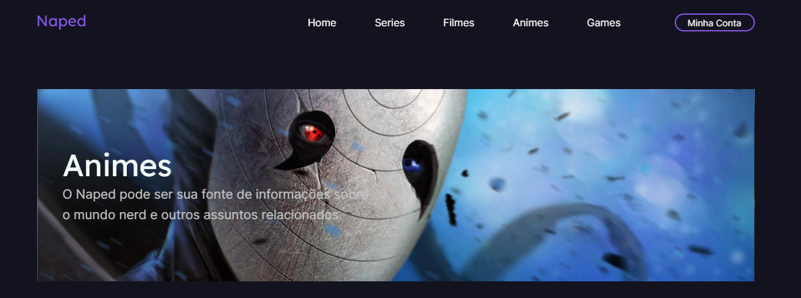

# NAPPED - Seu portal de notícias

# Como rodar o projeto?

* Baixe as dependências necessárias utilizando o yarn install.

# O que é esse projeto?

* Trata-se de um dos desafios gratuitos proposto pelo servidor do discord [Codelândia](https://discordapp.com/channels/853354677411905578/853363178901733387).

# Ferramentas utilizadas

* Next
* styled components
